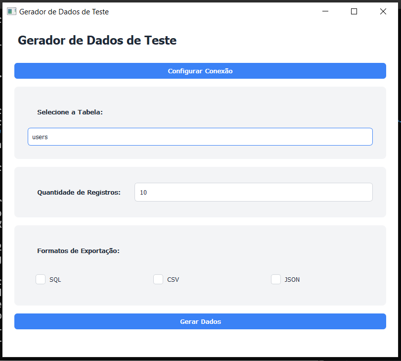

# 🧪 Gerador de Dados de Teste para MySQL

## Descrição do Projeto

O Gerador de Dados de Teste é uma aplicação desktop desenvolvida em Python que permite a criação automática e inteligente de dados fictícios para bancos de dados MySQL. A ferramenta oferece uma interface gráfica amigável para geração de dados de teste realistas, respeitando a estrutura e os tipos de dados das tabelas.

### 🌟 Principais Funcionalidades

- Conexão automática com banco de dados MySQL
- Identificação dinâmica de tabelas e estruturas
- Geração de dados realistas baseados no nome e tipo de coluna
- Suporte a múltiplos formatos de exportação (SQL, CSV, JSON)
- Interface gráfica intuitiva
- Geração de dados em português brasileiro

## 🛠 Requisitos do Sistema

- Python 3.8 ou superior
- Banco de dados MySQL
- Bibliotecas Python:
  - mysql-connector-python
  - PyQt5
  - Faker
  - pandas

## 📦 Instalação

### Clonar o Repositório

```bash
git clone https://github.com/aron-alvarenga/app-gerador-dados-teste.git
cd app-gerador-dados-teste
```

### Configurar Ambiente Virtual (Recomendado)

```bash
# Criar ambiente virtual
python -m venv venv

# Ativar ambiente virtual
# No Windows
venv\Scripts\activate
# No Linux/Mac
source venv/bin/activate
```

### Instalar Dependências

```bash
pip install -r requirements.txt
```

## 📝 Arquivo de Requisitos (requirements.txt)

```
mysql-connector-python
PyQt5
Faker
pandas
```

## 🚀 Como Executar

### Executar Diretamente

```bash
python main.py
```

### Gerar Executável

```bash
# Instalar PyInstaller
pip install pyinstaller

# Gerar executável
pyinstaller --onefile --windowed main.py
```

## 🔧 Configuração e Uso

1. Clique em "Configurar Conexão"
2. Preencha os dados de conexão do MySQL:
   - Host
   - Usuário
   - Senha
   - Nome do Banco de Dados
3. Selecione a tabela desejada
4. Defina a quantidade de registros
5. Escolha os formatos de exportação (SQL/CSV/JSON)
6. Clique em "Gerar Dados"

## 🧪 Testando o Sistema

### Testes Automatizados

```bash
# Executar testes (a implementar)
python -m unittest discover tests
```

### Casos de Teste Manuais

1. Conexão com banco de dados
2. Geração de dados para diferentes tipos de tabelas
3. Exportação em diferentes formatos
4. Tratamento de erros de conexão

## 🔒 Configurações de Segurança

- Não armazene credenciais de banco de dados diretamente no código
- Use variáveis de ambiente ou arquivos de configuração seguros
- Limite as permissões do usuário do banco de dados

## 🚧 Limitações Conhecidas

- Suporte apenas para bancos de dados MySQL
- Geração de dados pode não cobrir 100% dos casos complexos
- Requer conhecimento básico de banco de dados

## 🤝 Contribuições

Contribuições são bem-vindas! Por favor, abra uma issue ou envie um pull request.

## 📞 Contato

- https://www.linkedin.com/in/aron-alvarenga

## 🖼️ Imagem da aplicação

<div align="center">
  
</div>
